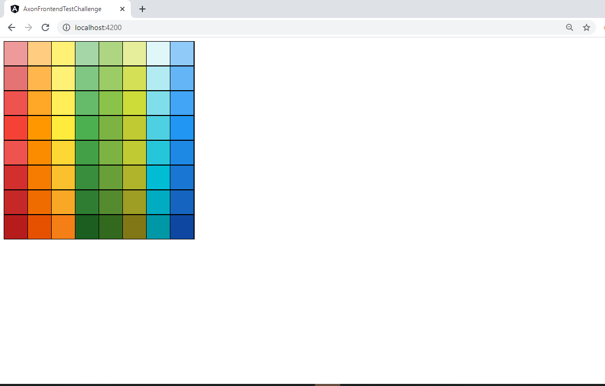
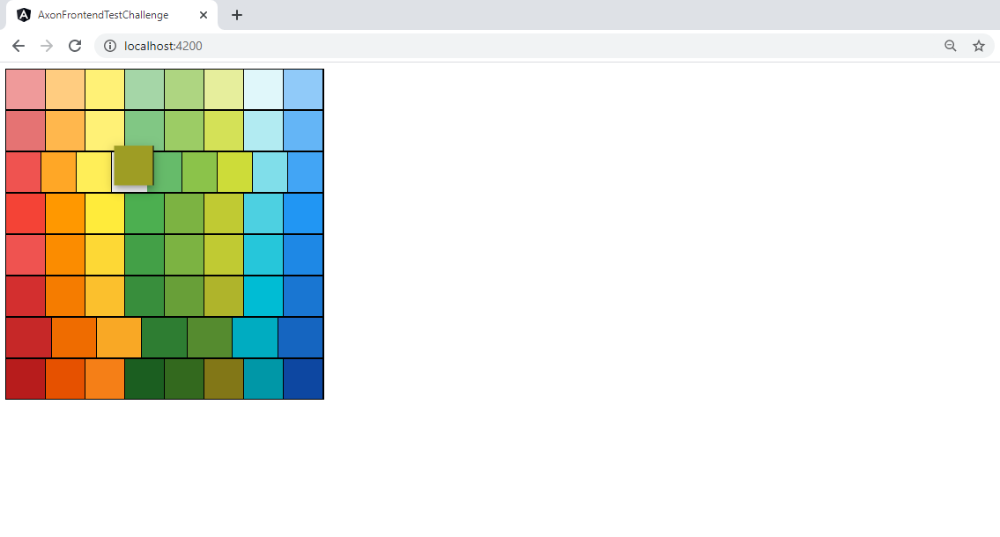
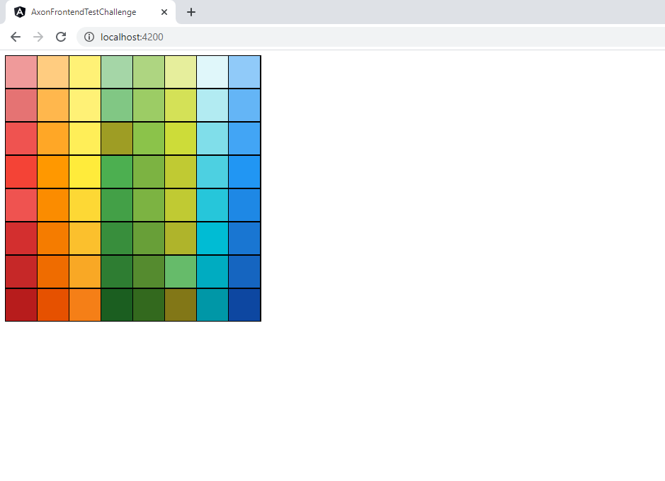

# Axon Frontend Test Challenge
A web application, which gives users an 8*8 board, in your choice of framework.

This project was generated with [Angular CLI](https://github.com/angular/angular-cli) version 8.3.20.
* Node: `version 10.16.0`
* npm: `version 6.9.0`
* TypeScript: `version 3.8.3`

## Quick Start

```
git clone '.\nguyen_ho_son_hoang.bundle'
cd nguyen_ho_son_hoang

# Install Angular CLI if necessary
npm install -g @angular/cli@latest

# Install dependencies
npm install

# Run application in development
npm start

Go to http://localhost:4200/ in your browser 
```

## Running the Application
1. Run `npm install`
1. Run `ng serve`
1. Go to http://localhost:4200/ in your browser 

## Useful Commands
* Run `ng build` to build the project.
* Run `ng build --prod` to build the project for prod
* Run `ng test` to execute the unit tests
* Run `ng e2e` to execute the end-to-end tests
* To get more help on the Angular CLI use `ng help` or go check out the [Angular CLI README](https://github.com/angular/angular-cli/blob/master/README.md).

## Screenshots

<br /><br />

<br /><br />

